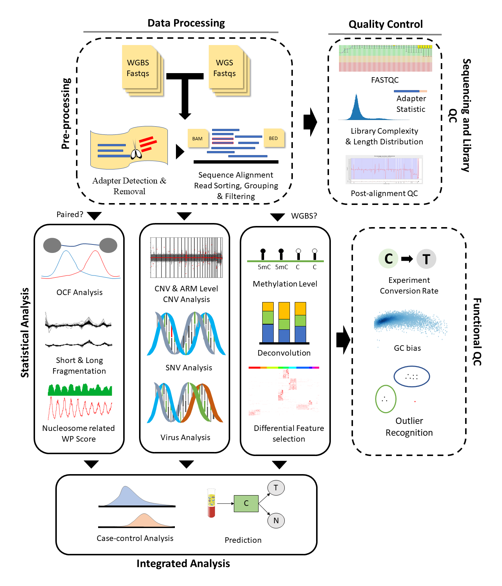

# cfDNApipe

&emsp;**cfDNApipe(<u>C</u>ell <u>F</u>ree <u>DNA</u> <u>Pipe</u>line)** is an integrated pipeline for analyzing [cell-free DNA](https://en.wikipedia.org/wiki/Circulating_free_DNA) WGBS/WGS data. It contains many cfDNA quality control and feature extration algorithms. Also we collected some useful cell free DNA references and provide them [here](https://honchkrow.github.io/cfDNAReferences/).

&emsp;The whole pipeline was established based on processing graph principle. Users can use the inside integrated pipeline for WGBS/WGS data as well as build their own analysis pipeline from any intermediate data like bam files. The main functions are as the following picture.



## Section 1: Installation Tutorial

### Section 1.1: System requirement

&emsp;The popular WGBS/WGS analysis softwares are released on Unix/Linux system, based on different program language, like Bowtie2 and Bismark. Therefore, it's very difficult to rewrite all the software in one language. Fortunately, [conda](https://docs.conda.io/en/latest/)/[bioconda](http://bioconda.github.io/) program collected many prevalent python mudules and bioinformatics software, so we can install all the dependencies through [conda](https://docs.conda.io/en/latest/)/[bioconda](http://bioconda.github.io/) and arrange pipelines using python.

&emsp;We recommend using conda environment and python >= 3.6. If you did not install conda before, please follow [this tutorial](https://docs.conda.io/projects/conda/en/latest/user-guide/install/) to install conda first.

&emsp;After installation, you can create a new virtual environment for cfDNA analysis. Virtual environment management means that you can install all the dependencies in this virtual environment and delete them easily by removing this virtual environment.

### Section 1.2: Create environment and Install Dependencies

&emsp;We test our pipeline using different version of software and provide an environment yml file for users. Users can download this file and create the environment in one command line. 

&emsp;first, please download the yml file.

```shell
wget https://raw.githubusercontent.com/Honchkrow/cfDNApipe/master/environment.yml
```

&emsp;Then, run the following command. The environment will be created and all the dependencies as well as the latest cfDNApipe will be installed.

```shell
conda env create -f environment.yml
```

### Section 1.3: Install cfDNApipe

&emsp;cfDNApipe can be downloaded from pypi, users can install easily by running the following command in "cfDNApipe" environment.

```shell
pip install cfDNApipe
```

&emsp;Once the package is installed, user can enter python or write scripts to processing **cell free DNA WGBS/WGS paired/single end** data.

## Section 2: A Quick Tutorial for Analysis WGBS data

&emsp;In this section, we will demonstrate how to perform a quick analysis for paired end WGBS data using the build-in pipeline.

### Section 2.1: Set Global Reference Configures

&emsp;First, user must set some important configure, for example, which genome to be used, how many threads should be used and where to put the analysis results. cfDNApipe provide a configure function for user to set these parameters. Below is an instance.

```Python
from cfDNApipe import *

pipeConfigure(
    threads=60,
    genome="hg19",
    refdir=r"./genome/hg19_bismark",
    outdir=r"./pipeline-for-paired-WGBS",
    data="WGBS",
    type="paired",
    build=True,
    JavaMem="10g",
)
```

&emsp;pipeConfigure function takes 8 necessary parameters as input. 
- **'threads'**: the max threads user want to be used. 
- **'genome'**: which genome to be used, must be 'hg19' or 'hg38'. 
- **'refdir'**: where to find genome reference files like sequence fasta file and CpG island ananotation files. 
- **'outdir'**: where to put all the output files.
- **'data'**: "WGBS" or "WGS".
- **'type'**: "paired" or "single".
- **'build'**: download and build reference or not after reference checking.
- **'JavaMem'**: maximum memory java program can used.

&emsp;Once done, the program will print "Background reference check finished!", then users can do the analyzing steps.

### Section 2.2: Perform build-in WGBS Analysis Pipeline

&emsp;cfDNApipe provides an integrated pipeline for paired/single end WGBS/WGS data, user can use it easily by assigning fastq sequencing files as the input of the pipeline. All the parameters used in pipeline are carefully selected after numerous tests.

```Python
res = cfDNAWGBS(inputFolder=r"path_to_fastqs",
                idAdapter=True,
                rmAdapter=True,
                dudup=True,
                CNV=True,
                armCNV=True,
                fragProfile=True,
                verbose=True)
```

In the above example, user just pass the input folder which contains all the rwaw fastq files to the function, then the processing will start and all results will be saved in outdir mentioned in the former section.

What's more, cfDNApipe also provides **case and control**  comparison analysis for WGBS/WGS data. For using this function, please see function **cfDNAWGS2** and **cfDNAWGBS2**.

## Section 3: cfDNApipe 

./  
├── pipeline-for-paired-WGBS/  
&ensp;&ensp;&ensp;&ensp;├── final_result/  
&ensp;&ensp;&ensp;&ensp;├── report_result/  
&ensp;&ensp;&ensp;&ensp;│&ensp;&ensp;&ensp;├── Cell_Free_DNA_WGBS_Analysis_Report.html  
&ensp;&ensp;&ensp;&ensp;│&ensp;&ensp;&ensp;└── Other files and folders  
&ensp;&ensp;&ensp;&ensp;└── intermediate_result/  
&ensp;&ensp;&ensp;&ensp;&ensp;&ensp;&ensp;&ensp;├── step_01_inputprocess  
&ensp;&ensp;&ensp;&ensp;&ensp;&ensp;&ensp;&ensp;├── step_02_fastqc  
&ensp;&ensp;&ensp;&ensp;&ensp;&ensp;&ensp;&ensp;├── step_02_identifyAdapter  
&ensp;&ensp;&ensp;&ensp;&ensp;&ensp;&ensp;&ensp;└── Other processing folders  

There will be 3 major ouput folder, named final_result, report_result and intermediate_result. Folder 'final_result' is an empty folder for users to save any result for this analysis. Folder 'report_result' save a html report and related data which shows some visualization results like quality control and figures. Folder 'intermediate_result' contains many folder named by every single step, all the intermediate results and processing record will be save in each folder.


Parameter 'build' means whether to check references. If not detected, references will be downloaded and built. For example, if human genome 'hg19' is specified and there is no this reference genome file in refdir, then hg19.fa will be downloaded from UCSC and other annotation files will be downloaded from [cfDNAReferences](https://honchkrow.github.io/cfDNAReferences/). This step is necessary but put things right once and for all. If user already build references for Bismark (a folder contains Bisulfite_Genome and hg19.fa), then just set this folder as refdir, the program will skip download hg19.fa and rebuild Bismark reference. cfDNApipe will only download other references and this will save lots of times.


## Section 4: How to Build Customized Pipepline using cfDNApipe

Some users are familiar with cfDNA processing and want to customize their own pipelines. cfDNApipe provide a flexible pipeline framework for building pipeline like 

## Section 5: Anlysis Step Explanations
